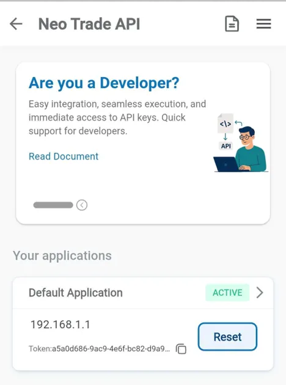
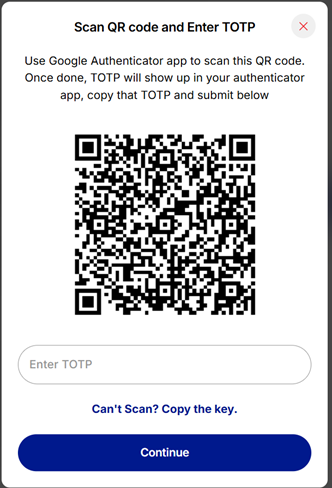

# Getting started (15 min)

## 🚀 Getting Started

*Follow these 5 steps to place your first order in 15-20 minutes*

## **Progress:** Step 1 of 5 → Prerequisites

### What You Can Build

The Kotak Neo Trade API lets you:

- **Trade programmatically** - Place, modify, and cancel orders across equity and F&O
- **Monitor portfolios** - Track holdings, positions, and P&L in real-time
- **Access market data** - Get live quotes for stocks, ETFs, and indices
- **Check margins** - Validate order feasibility before placing
- **Automate strategies** - Build algorithmic trading systems

### Step 1: Prerequisites (5 minutes)

Complete these setup steps before you can start trading:

### ☑️ 1. Get Your API Access Token

API Dashboard:



**Steps:**

1. Open NEO app or web
2. Navigate to: More **→ TradeAPI → API Dashboard**
3. Click **"Create Application"**
4. Copy the token shown after creation

**Save this token securely** - you'll need it for for login and data APIs

**Token format example:** ec6a746c-e44b-455e-abf2-c13352b2fc45

### ☑️ 2. Register TOTP Authentication

Register for TOTP : [http://bit.ly/4h4LByx](http://bit.ly/4h4LByx)

**What is TOTP?** Time-based One-Time Password generates a new 6-digit code every 30 seconds in an authenticator app. This is your dynamic password for API login.

**Steps:**

1. In API Dashboard, click **"TOTP Registration"**
2. Verify with your mobile number and OTP
3. Download **Google Authenticator** or **Microsoft Authenticator** from app store
4. Scan the QR code displayed on screen
5. Enter the 6-digit TOTP code shown in the authenticator app
6. Confirm when you see "TOTP successfully registered"

Example:

1. TOTP Registration screen: on verification of mobile number, otp and client code



1. Scan QR from authenticator app, Enter these 6 digits reflecting on authenticator app for Kotak-NEO, and click continue. You will get success toast which means registration of totp is complete.


1. On continue. You will get success toast which means registration of totp is complete. In case of service error, try again after 5mins.

**⚠️ Common Issue:** "Invalid TOTP"

**Solution:**

Ensure your phone's time is set to automatic (Settings → Date & Time → Set Automatically)

### ☑️ 3. Find Your UCC (Client Code)

**Steps:**

1. Go to NEO app/web Profile section
2. Your UCC is displayed as "Client Code"
3. Format: 5 characters (e.g., "AB123")


**Save your UCC** - you'll need it for authentication.

### ☑️ 4. Your 6-digit MPIN

- This is your trading PIN used to authorize orders in NEO app
- You use the same MPIN for API authentication

**If you don't remember it:**

- NEO app → Profile → Settings → Change MPIN

**✓ Prerequisites Complete!** Now you're ready to authenticate and place orders.

## **Progress:** Step 2 of 5 → Authentication

### Step 2: Authenticate (5 minutes)

Authentication is a 2-step process:

Step 2a: TOTP Login → Get temporary tokensStep 2b: MPIN Validate → Get trading access

### Step 2a: Login with TOTP

**What it does:** Verifies your identity using mobile number, UCC, and TOTP.

**Endpoint:** POST https://mis.kotaksecurities.com/login/1.0/tradeApiLogin

**Example Request:**

```jsx
curl --location 'https://mis.kotaksecurities.com/login/1.0/tradeApiLogin' \
--header 'Authorization: YOUR_ACCESS_TOKEN' \
--header 'neo-fin-key: neotradeapi' \
--header 'Content-Type: application/json' \
--data '{
    "mobileNumber": "+91XXXXXXXXXX",
    "ucc": "YOUR_CLIENT_CODE",  
    "totp": "TOTP_FROM_AUTHENTICATOR_APP"
}'
```

**What to send:**

- mobileNumber: Your registered mobile with country code (+91)
- ucc: Your 5-character client code from Step 1.3
- totp: Current 6-digit code from authenticator app

**Success Response:**

```jsx
{  "data": 
{    
"token": "eyJhbGciOiJ...",     // Save as VIEW_TOKEN   
"sid": "xxxxxx-xxxx-xxxx",     // Save as VIEW_SID   
"kType": "View",    
"status": "success"  
}}
```

**💾 Important:** Save token and sid from this response - you need them for Step 2b.

### Step 2b: Validate with MPIN

**What it does:** Upgrades your access to full trading permissions.

**Endpoint:** POST https://mis.kotaksecurities.com/login/1.0/tradeApiValidate

**Example Request:**

```jsx
curl --location 'https://mis.kotaksecurities.com/login/1.0/tradeApiValidate' \
--header 'Authorization: YOUR_ACCESS_TOKEN' \
--header 'neo-fin-key: neotradeapi' \
--header 'sid: VIEW_SID_FROM_STEP_2A' \
--header 'Auth: VIEW_TOKEN_FROM_STEP_2A' \
--header 'Content-Type: application/json' \
--data '{
    "mpin": "YOUR_SIX_DIGIT_MPIN"
}'
```

**Success Response:**

```jsx
{  "data": 
	{    
	"token": "eyJhbGciOiJ...",                          // Save as TRADING_TOKEN    
	"sid": "xxxxxx-xxxx-xxxx",                          // Save as TRADING_SID    
	"baseUrl": "https://cis.kotaksecurities.com",       // Save as BASE_URL    
	"kType": "Trade",    
	"status": "success"  
	}
}
```

**🎯 You're now authenticated!**

**Save these three values for all subsequent API calls:**

1. **TRADING_TOKEN** - use as Auth header
2. **TRADING_SID** - use as Sid header
3. **BASE_URL** - prepend to all trading endpoints

## **Progress:** Step 3 of 5 → Place Your First Order

### Step 3: Place Your First Order (5 minutes)

Now that you're authenticated, let's place a simple market buy order.

### Get Trading Symbol (Quick)

Before placing orders, you need the correct trading symbol:

**Endpoint:** GET {BASE_URL}/script-details/1.0/masterscrip/file-paths

**Headers:** Only needs Authorization: YOUR_ACCESS_TOKEN

**Quick Example:**

```jsx
curl '{BASE_URL}/script-details/1.0/masterscrip/file-paths' \  -H 'Authorization: YOUR_ACCESS_TOKEN'
```

**Response:** Download links to CSV files containing all tradeable instruments.

**For this example, we'll use:** ITBEES-EQ (Nifty IT ETF)

**📌 Note:** Download scrip master daily for accurate symbols. See complete Scrip Master documentation for details.

### Place Market Buy Order

**Endpoint:** POST {BASE_URL}/quick/order/rule/ms/place

**Example Request:**

```jsx
curl --location 'YOUR_BASE_URL/quick/order/rule/ms/place' \
--header 'Auth: YOUR_TRADING_TOKEN' \
--header 'Sid: YOUR_TRADING_SID' \
--header 'neo-fin-key: neotradeapi' \
--header 'Content-Type: application/x-www-form-urlencoded' \
--data-urlencode 'jData={"am":"NO", 
"dq":"0",
"es":"nse_cm", 
"mp":"0", 
"pc":"CNC", 
"pf":"N", 
"pr":"0", 
"pt":"MKT", 
"qt":"1", 
"rt":"DAY", 
"tp":"0", 
"ts":"ITBEES-EQ", 
"tt":"B"}'
```

**What this does:** Places a market buy order for 1 unit of ITBEES ETF (Nifty IT ETF) for delivery.

**Understanding the parameters:**

- es: "nse_cm" = NSE Cash Market
- pc: "CNC" = Cash & Carry (delivery)
- pt: "MKT" = Market order (buy at current price)
- qt: "1" = Quantity
- ts: "ITBEES-EQ" = Trading symbol
- tt: "B" = Buy

**Success Response:**

```jsx
{  "nOrdNo": "250720000007242",   // Order ID - save this!  "stat": "Ok",  "stCode": 200}
```

**🎉 Congratulations!** You've placed your first order via API.

Error Code: [Refer troubleshooting section](Troubleshooting%20-%20FAQs%20Error%20codes%20b3ff51d906cb833e9e86012912a2bc5a.md)

## **Progress:** Step 4 of 5 → Check Order Status

### Step 4: Check Order Status (2 minutes)

**Endpoint:** GET {BASE_URL}/quick/user/orders

**Example Request:**

```jsx
curl -X GET "YOUR_BASE_URL/quick/user/orders" \  -H "Auth: YOUR_TRADING_TOKEN" \  -H "Sid: YOUR_TRADING_SID" \  -H "neo-fin-key: neotradeapi"
```

**Response:** Shows all your orders for today with their status.

**Key fields to check:**

- nOrdNo: Order ID
- ordSt: Order status ("open", "complete", "rejected", etc.)
- avgPrc: Average execution price
- rejRsn: Rejection reason (if rejected)

## **Progress:** Step 5 of 5 → What's Next

### Step 5: What's Next?

**✅ You've successfully:**

- Completed setup and authentication
- Placed your first order
- Checked order status

**Continue your journey:**

Basic Operations: 
•	[Modify pending orders](Modify%20order%207baf51d906cb827e886a0149be20f72f.md) - Change price or quantity
•	[Cancel orders](Cancel%20Order%201d5f51d906cb82088524818cc83900be.md) - Cancel before execution
•	[Check your portfolio](Holdings%2006af51d906cb821c846d01e06eac0846.md) - View all holdings
•	[View positions](Positions%206e1f51d906cb83989fb501f581dd6ffc.md) - Today's open positions
•	[Check available funds](Limits%207e4f51d906cb82f29bbe01dbb2d589a4.md) - Available margin
Advanced Features:
•	[Place different order types](Place%20Order%20c77f51d906cb8280842a01c77b17b00d.md) - Limit, Stop Loss, BO, CO
•	[Get live market quotes](Quotes%209fdf51d906cb83ac810701bab6ab4e6c.md) - Real-time price data
•	[Check margin requirements](Margins%207bef51d906cb8319ab8e8179a80216ab.md) - Before placing orders
Troubleshooting:
•	[Common errors and solutions](Troubleshooting%20-%20FAQs%20Error%20codes%20b3ff51d906cb833e9e86012912a2bc5a.md)

•	[cURL Examples](cURL%20examples%202cff51d906cb823899be81c19e34f73f.md)
Need help?
•	Jump to [API reference section](API%20Reference%208b2f51d906cb825e9333017fbcc9c7b5.md)