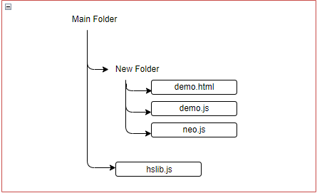
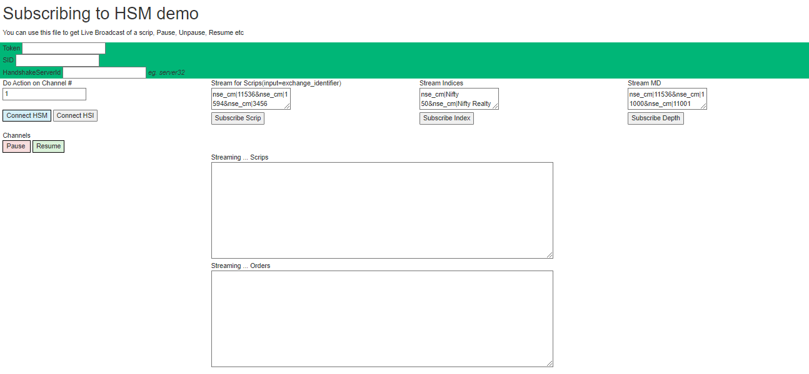
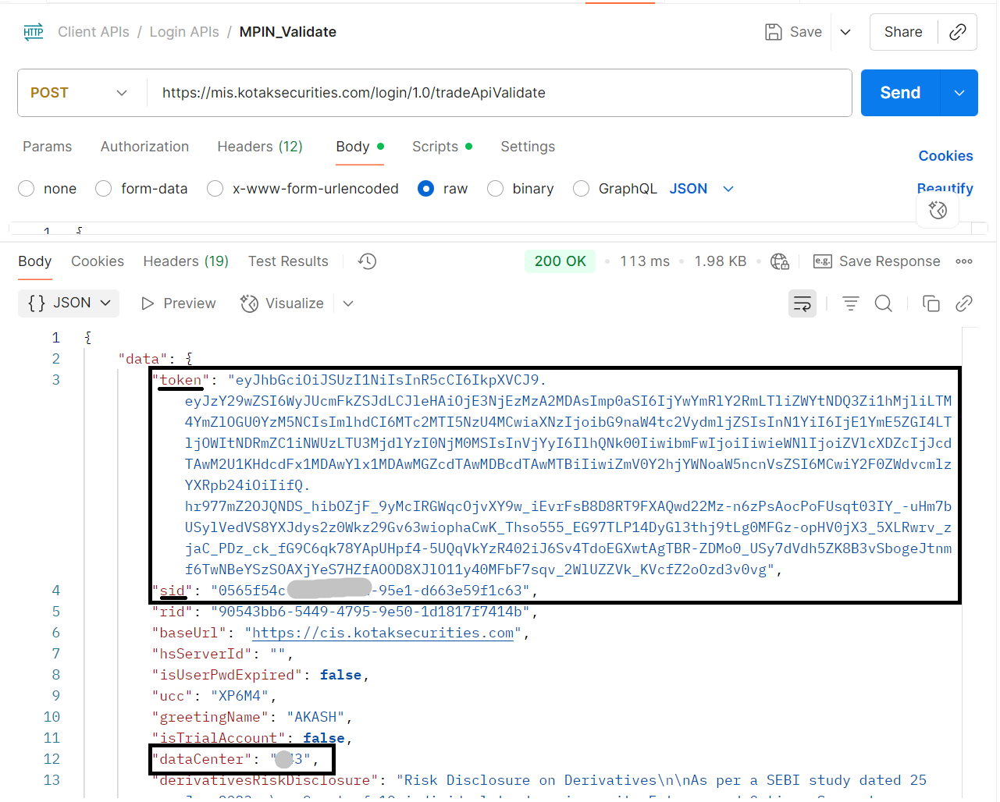
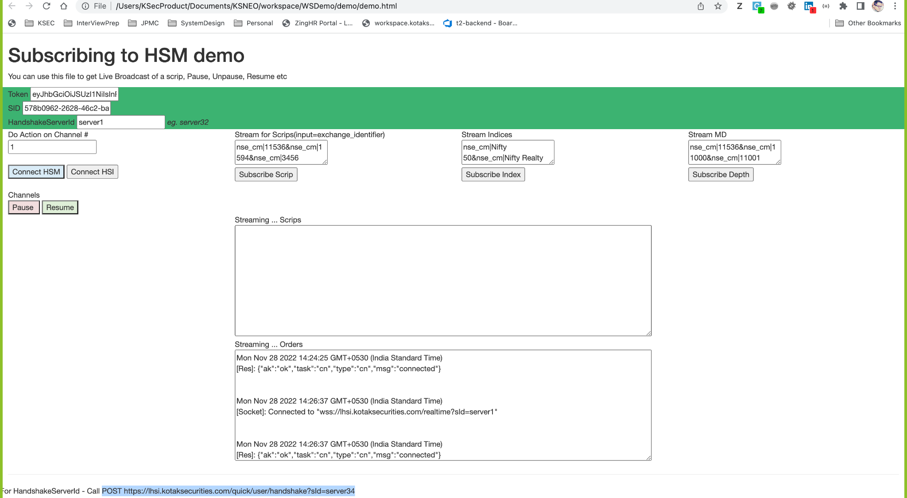
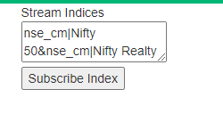
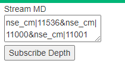

# NEO Websocket

[Websocket (2).zip](Websocket_(2).zip)

Kotak Neo Websocket zip contains 4 major files :

1. HSLib

2. Demo.html

3. Demo.js

4. Neo.js

To Start the websocket make sure the position of these files are aligned as shown in below example :

To Start Websocket open demo.html file, this file will open a web page in your browser which will like this :

Now to establish the connect user needs to pass 3 parameters

- **Token** : Final token(session token) which user gets after running login api
- **sid** : received along with session sid after running login api
- **Data Center**: In response to login API, you get data center. like E43, E41, etc

`'dataCenter': '123'`

Note: If you’re using postman for testing [https://mis.kotaksecurities.com/login/1.0/tradeApiValidate](https://mis.kotaksecurities.com/login/1.0/tradeApiValidate) would return all the above 3 values.

Example:

## Connect to Market feed / websocket :

Lets understand how to connect to HSM

HSM is nothing but that which streams market data.

When we pass Session Token, SID and data center we can connect with HSM. Click on “Connect HSM”

### Subscribe Scrip :

Here user have to provide the exchange identifier to start receiving the Feeds.

How to add scrip :

Ex : nse_cm|11536&

1 input of scrip consist of exchange name then a pipe separation (|) followed by scrip identifier.

To add another scrip simultaneously you can add in the same input by putting &(ampersand)seperation.

### Subscribe Index :

Here user have to provide the exchange identifier of indices to start receiving the Feeds.

How to add index:

Ex : nse_cm|Nifty 50&

1 input of index consist of exchange name then a pipe separation (|) followed by index identifier.

To add another index simultaneously you can add in the same input by putting &(ampersand)seperation.

### Subscribe Depth:

Ex : nse_cm|11536&

1 input of market depth consist of exchange name then a pipe separation (|) followed by scrip identifier.

To add another Market Depth Scrip simultaneously you can add in the same input by putting &(ampersand)seperation.

## Connect to Order feed:

HSI is noting but stream that delivers order updates. You can connect with HSI to view feeds of Orders you have placed. The feeds will be reflected in Streaming Orders Column

## Integrating market feed or order feed in the code?

By running the inspect to the demo.html file you can get the websocket string.

Total No of Channels user’s can use at a time : 16

Total No of Scrips user’s can subscribe at a time : 200

For Indepth detail of Websocket Functions: [Refer this](https://www.hypersync.in/hs_interactive_api_js/)